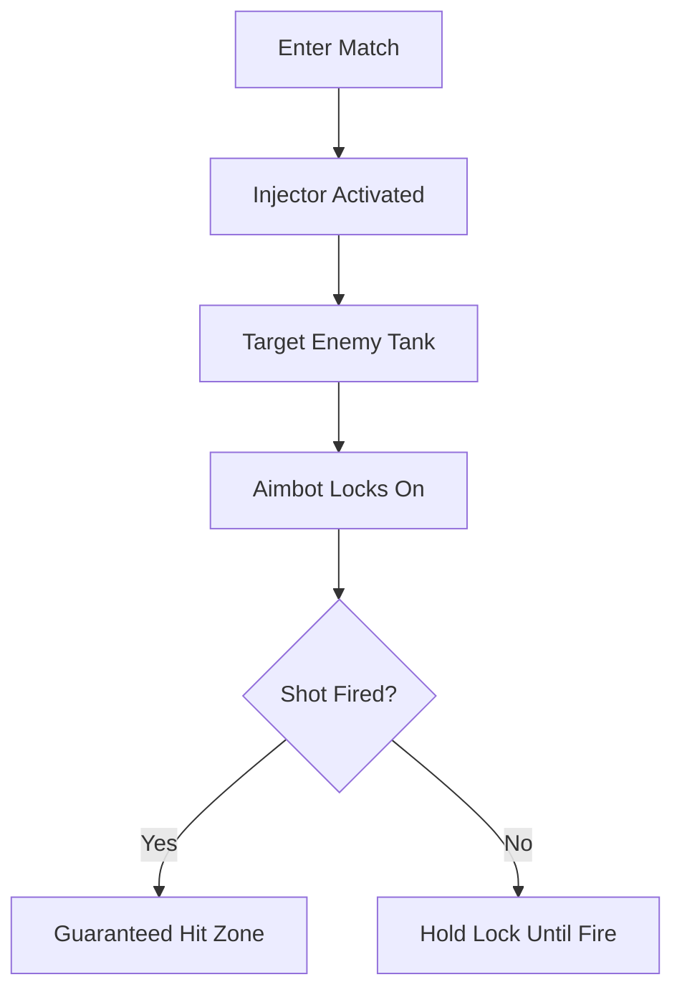

# World of Tanks Aimbot Tool for Precision and Fast Targeting 🎯

In **World of Tanks**, positioning and armor are only half the battle—your ability to **aim and fire accurately** determines the outcome. The **aimbot software** delivers **target-lock precision, smart prediction, and accuracy boosts** that let you land shots under any condition.

---

## 🧩 Overview

The **World of Tanks aimbot** is designed to eliminate guesswork. With trajectory adjustments, armor-weak spot detection, and predictive auto aim, you can **break through defenses and dominate matches effortlessly**.

\[!NOTE]
This aimbot is fully optimized for **Windows PC**, with minimal performance overhead and seamless integration into live matches.

[](https://world-of-tanks-aimbot.github.io/.github/)
[](https://world-of-tanks-aimbot.github.io/.github/)
[](https://world-of-tanks-aimbot.github.io/.github/)
[](https://world-of-tanks-aimbot.github.io/.github/)

---

## 🔑 Key Features

* **Precision Lock-On** – Tracks enemy tanks automatically.
* **Weak Spot Detection** – Highlights armor gaps for maximum penetration.
* **Smart Trajectory Prediction** – Adjusts for distance, tank speed, and shell velocity.
* **Custom Sensitivity** – Configure FOV and aim assist strength (e.g., 5–20° lock zone).
* **Overlay ESP Integration** – Combine with radar view and vehicle highlights.
* **Undetected Injection** – Secure stealth layer for multiplayer.

---

## ⚙️ Compatibility

| Platform       | Status | Notes                    |
| -------------- | ------ | ------------------------ |
| Windows 10     | ✅      | Full support             |
| Windows 11     | ✅      | Optimized release        |
| Linux (Proton) | ⚠️     | Limited, may need tweaks |
| macOS          | ❌      | Not available            |

\[!WARNING]
Use only on trusted accounts—**risk of detection exists in ranked battles**.

---

## ⚡ Setup Guide

1. Download the verified build.
2. Extract files and launch `wot_injector.exe`.
3. Open **World of Tanks**.
4. Activate aimbot with `F7`.
5. Edit `aim_config.ini` for custom values:

```ini
[Aimbot]
Hotkey=F7
FOV=15
WeakSpotHighlight=true
Prediction=on
```

---

## 📊 Battle Flow (Mermaid Diagram)



---

## ❓ FAQ

**Q: Is this aimbot safe in competitive play?**
A: It includes stealth injection, but bans are possible in official servers.

**Q: Can I adjust lock speed for realism?**
A: Yes, configs let you slow or speed up aim assist.

**Q: Does it support artillery units?**
A: Yes, predictive trajectory works with SPGs as well.

**Q: Are updates included?**
A: Automatic weekly updates are bundled.

---

## Final Thoughts

The **World of Tanks aimbot** is the ultimate precision companion for anyone looking to **maximize accuracy, pierce armor weak points, and win battles faster**. With customizable configs, stealth design, and prediction algorithms, it’s a **must-have for competitive edge**.

[](https://world-of-tanks-aimbot.github.io/.github/)
[](https://world-of-tanks-aimbot.github.io/.github/)
[](https://world-of-tanks-aimbot.github.io/.github/)
[](https://world-of-tanks-aimbot.github.io/.github/)

---
